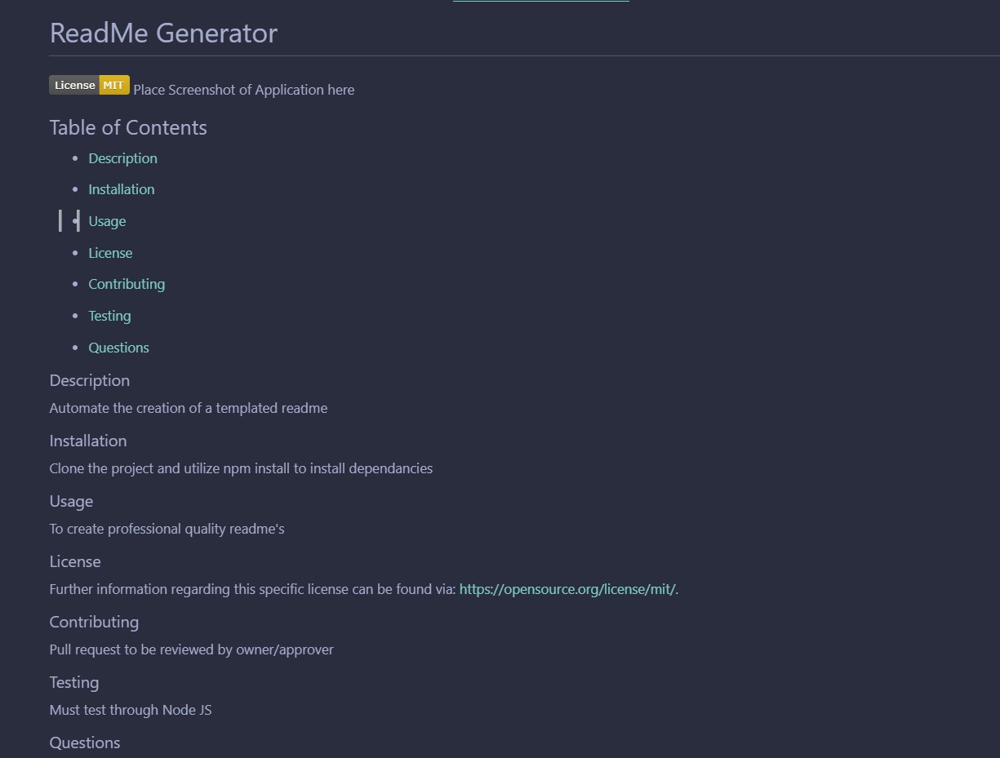
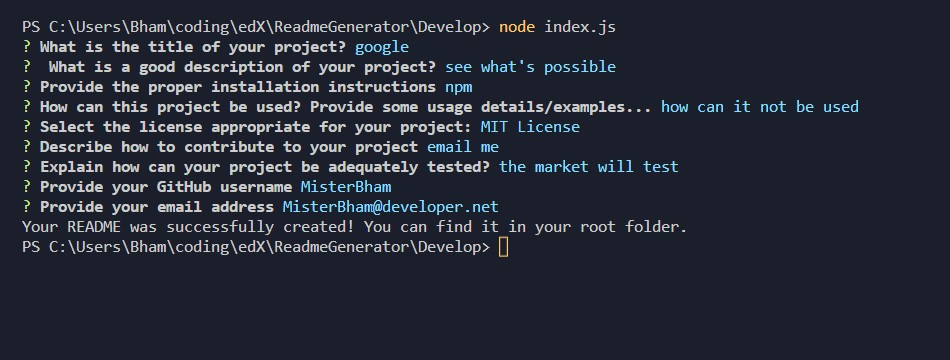

# ReadMe Generator

## Table of Contents 
* [Description](#Description) 

* [Installation](#Installation) 

* [Usage](#Usage) 

* [License](#License) 

* [Contributing](#Contributing) 

* [Testing](#Testing) 

* [Questions](#Questions) 

### Description
Command Line Node application that generates a professional readme based upon the answers to appropriate input questions

### Installation
npm install

### Usage
Through NodeJS, using specifically inquirer. 
See sample created readme file <a href="./Develop/example-README.md">here</a>.
See sample video <a href="https://drive.google.com/file/d/1SnhBYBarDqrJgarqy9oQO5H36mk4nlyH/view">here</a>.
Examples of created readme and example workflow below. 

### License
Further information regarding this specific license can be found via: https://opensource.org/license/mit/. 

### Contributing
Please post <a href="https://github.com/MisterBham/ReadmeGenerator/issues">Issues</a> on the repo!

### Testing
No tests included

### Questions
Should you have any further questions, please reach the developer at: MisterBham@developer.net. 

### Examples:

